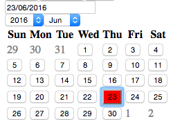

# DPicker

[](https://travis-ci.org/soyuka/dpicker)

Basic date picker



[*Foundation style + french locales*](https://github.com/soyuka/dpicker#foundation-style-scss)

## Installation

### npm

```
npm install dpicker --save
```

### bower

```
bower install dpicker --save
```

## Usage

DPicker depends on moment and maquette. Those can be included with your favorite module loader or through a CDN, for example:

```html
<script type="text/javascript" src="https://cdnjs.cloudflare.com/ajax/libs/moment.js/2.13.0/moment.min.js"></script>
<script type="text/javascript" src="https://cdnjs.cloudflare.com/ajax/libs/maquette/2.1.6/maquette.min.js"></script>
```

To create a date picker, just init the DPicker module within a container:

```html
<div id="my-datepicker"></div>
<script>
var dp = new DPicker(document.getElementById('my-datepicker'))
</script>
```

You may want to add some css:

```css
td.dpicker-inactive {
  color: grey;
}

button.dpicker-active {
  background: red;
}

.dpicker-invisible {
  display: none;
}

.dpicker-visible {
  display: block;
}

.dpicker-container {
  position: absolute;
}
```

## Options

```javascript
{boolean} options.display Display the date picker or not (default false)
{Moment} options.model Your own model instance, defaults to moment()
{Number} options.futureYear The latest year available in the date picker
{Number} options.minYear The minimum year (default to 1986)
{string} options.format The input format, a moment format, default to DD/MM/YYYY
{string} options.inputId The input id, useful to add you own label
```

Every property is available through the `DPicker` instance and can be changed through the object lifecycle.

Here is how to change the format for example:

```javascript
let dpicker = new DPicker(document.body);
// ... do things
dpicker.format = 'YYYY' //change the format
```

If you change locale moment, changes will automatically be taken into consideration. For example, set `moment.locale('fr')` to use french months.

## Foundation style (SCSS)

```scss
.dpicker {
    .dpicker-container {
        width: 300px;
        flex-wrap: wrap;
        justify-content: space-between;
        padding: 15px;
        position: absolute;
        background: $black;

        &.dpicker-invisible { display: none; }
        &.dpicker-visible { display: flex; }

        > select {
            flex: 0 0 49%;
        }

        > table {
            color: $white;
            text-align:center;

            td {
                border-collapse: collapse;
                border: 1px solid $gray;
            }

            .dpicker-inactive { font-size: $small-font-size; color: scale-color($black, $lightness: 50%); }

            .dpicker-active button {
                @include button($expand: true)
                margin: 0;
                padding: 0.4em 0;

                &.dpicker-active {
                    background-color: scale-color($primary-color, $lightness: -20%);
                }
            }
        }
    }
}
```

## License

MIT
